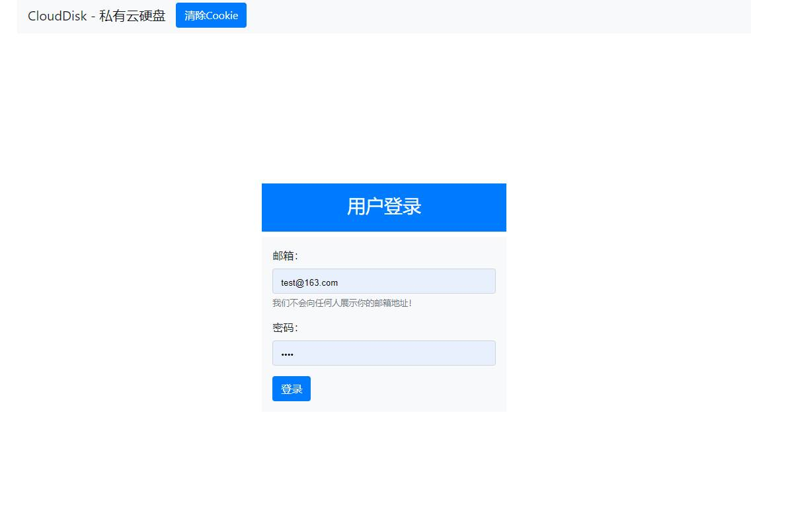
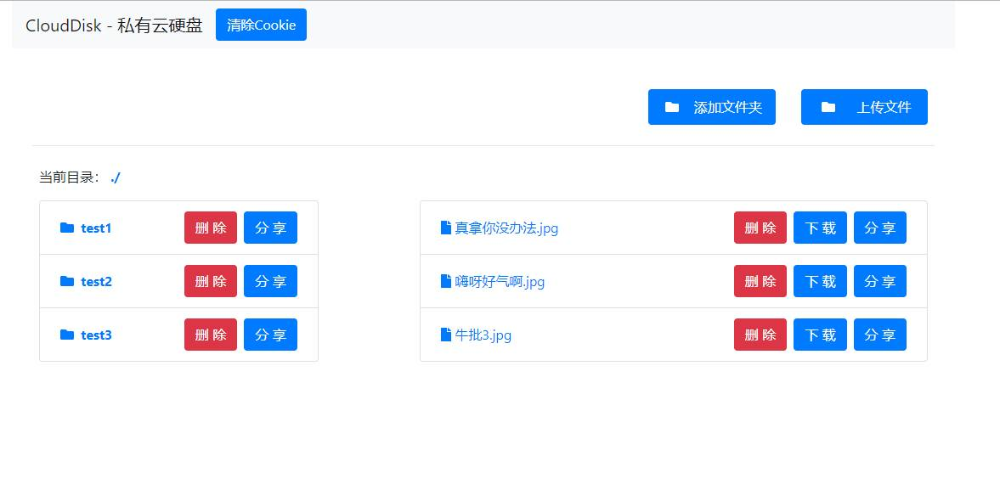
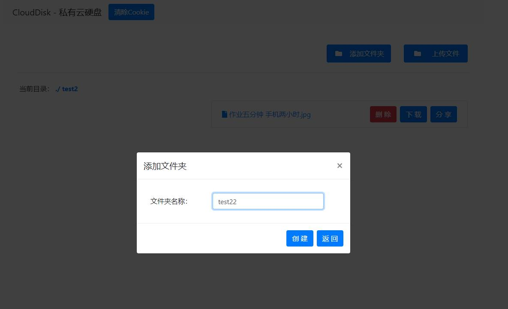

# CloudDisk
基于Flask和React实现的网页端云网盘

## 本工程基于实验楼课程修改
### 原始课程内容
- 课程地址：[https://www.shiyanlou.com/courses/1212](https://www.shiyanlou.com/courses/1212)
- 项目技术：
    1. 使用了React前端框架和Flask基于Python的后台开发框架
    2. ORM层使用了peewee与sqlite数据库通信
    3. 使用token机制和cookie实现验证
- 项目功能：
    1. 创建目录，文件上传、下载功能，目录不可嵌套，且本地无法直接访问源文件，本地文件操作无法反应到数据库和前端界面
    2. 文件公开分享、私密分享功能
- 注意：基本代码与教程一致，修改的内容如下：
    - 使用了Bootstrap4代替了Bootstrap3，图标库使用了Awesome和Octicon，使用方式：
        - [react-fontawesome](https://github.com/FortAwesome/react-fontawesome)   
        - [react-octicon](https://github.com/insin/react-octicon)
    - 修改教程中部分错误代码，请与官网源码对比
- 使用步骤：
    - 后台Flask：
    
        0. 需要安装好Pycharm
        1. 使用Pycharm打开server文件夹的项目
        2. 可以新建一个本地的venv环境，也可使用全局的python解释器
        3. 之后安装被标记的未安装的依赖
        4. flask相关配置在config.py文件里
        5. 运行DBCreate.py建立数据库，在根目录下新建upload文件夹
        
        6. 可以直接运行app.py，因为static文件夹包含了已经部署好的前端代码，浏览器输入localhost:5000进入主页；账号是test@163.com，密码是test
    - 前端React：
    
        0. 需要配置好npm，可以安装node.js，此项目使用的是v10.16.3版本；安装Idea；
        1. 使用Idea打开app路径下的项目
        2. 配置编译环境，点击Add Configuration，再点击加号，添加npm，在右边scripts填入'start'
        
        3. 点击右下方的npm install安装依赖
        4. 开启后台服务器后可以使用前端访问，注意，跨域问题可能导致无法验证cookie登录状态！
- 展示：

### 修改后的工程
- 功能：
    1. 目录可以嵌套，可以通过硬盘访问，可以检测硬盘文件、文件夹内容改变
